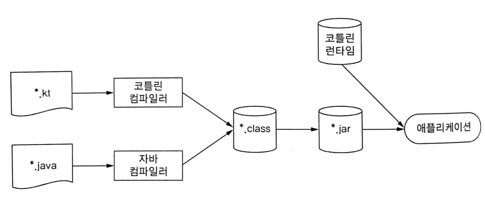

# 1. 코틀린이란 무엇이며 왜 필요한가?

---

- 코틀린은 자바 플랫폼에서 돌아가는 새로운 프로그래밍 언어다.
- 간결하고 실용적이며, 자바 코드와의 상호운용성(interoperability)을 중시한다.
- 자바를 사용하는 곳이면 거의 대부분 코틀린을 활용할 수 있다.
    - 서버 개발, 안드로이드 앱 개발
- 기존 라이브러리나 프레임워크가 잘 작동하며 성능도 자바와 같은 수준이다.

# 1.1 코틀린 맛보기

[Kotlin Playground: Edit, Run, Share Kotlin Code Online](https://play.kotlinlang.org/)

위의 링크를 통해 코틀린 코드를 작성해 볼수 있다.

```kotlin
// 데이터 클래스
data class Person(
    val name: String,
    val age: Int? = null  // 널이 될 수 있는 타입(Int?)과 파라미터 디폴트 값
)

fun main(args: Array<String>) {
    val persons = listOf(Person("영희"), Person("철수", age = 29));
    val oldest = persons.maxByOrNull { it.age ?:0 }
    println("나이가 가장 많은 사람: $oldest")
}
```

- `name`과 `age`라는 프로퍼티가 들어간 간단한 데이터 클래스(`data class`)
- age 프로퍼티의 디폴트 값은(따로 지정하지 않은 경우) null
- 리스트에서 가장 나이가 많은 사람을 찾기 위해 `maxBy` 함수 사용
    - maxBy 함수에 전달한 람다 식(lambda expression)은 파라미터를 하나 받는다.
    - `it`라는 이름을 사용하면[⁽¹⁾](https://www.notion.so/1-631de1a50d6a423185ab15eec203ec24) 유일한 인자를 사용할 수 있다.
    - 엘비스 연산자라고 부르는 `?:`는 `age`가 `null`인 경우 0을 반환하고 그렇지 않는 경우 `age`의 값을 반환한다
    - 영희의 나이는 지정하지 않았지만 엘비스 연산자가 `null`을 `0`으로 변환해주기 때문에 값 비교가 가능

# 1.2 코틀린의 주요 특성

코틀린의 핵심 특성을 알아보자

## 1.2.1 대상플랫폼 : 서버, 안드로이드 등 자바가 실행되는 모든 곳

- 코틀린의 주목적은 자바가 사용되는 모든 용도에 적합하면서, 더 간결하고 생산적이며 안전한 대체 언어를 제공하는 것
- 코틀린을 활용할 수 있는 가장 일반적인 영역
    - 서버상의 코드(특히 웹 애플리케이션의 백엔드)
    - 안드로이드 디바이스에서 실행되는 모바일 애플리케이션
- 다른환경에서도 잘 작동한다
    - 인텔의 멀티OS 엔진을 사용하면 코틀린을 IOS 디바이스에서 실행할 수 있다.
    - 데스크탑 애플리케이션을 작성하고 싶다면 코틀린과 토네이도FX, 자바FX 등을 사용할 수 있다.
    - 자바스크립트로도 코틀린을 컴파일 할 수있다[⁽²⁾](https://www.notion.so/1-631de1a50d6a423185ab15eec203ec24)
- JetBrains는 코틀린 네이티브 백엔드를 개발 중이다.
- 코틀린이 정한 목표 영역은 상당히 광범위 하다.

## 1.2.2 정적 타입 지정 언어

- 코틀린도 정적 타입(statically typed) 지정 언어다.
    - 모든 프로그램 구성 요소의 타입을 컴파일 시점에 알 수 있고 프로그램 안에서 객체의 필드나 메소드를 사용할 때마다 컴파일러가 타입을 검증해준다
- 자바와 달리 코틀린에서는 모든 변수의 타입을 프로그래머가 직접 명시할 필요가 없다.
    - 코틀린 컴파일러가 문맥으로부터 변수 타입을 자동으로 유추할 수 있기 때문 → 타입 추론(type inference)
        
        ```kotlin
        var x = 1
        // 변수 x는 정수(Int)값으로 초기화한다.
        // 변수의 타입이 Int임을 자동으로 알아낸다.
        ```
        
- 정적 타입 지정의 장점은 다음과 같다
    - **성능** :
        - 실행 시점에 어떤 메소드를 호출할지 알아내는 과정이 필요 없으므로 메소드 호출이 빠르다
    - **신뢰성**
        - 컴파일러가 프로그램의 정확성을 검증하기 때문에 런타임시 프로그램이 오류로 중단될 가능성이 적어진다
    - **유지 보수성**
        - 코드에서 다루는 객체가 어떤 타입에 속하는지 알 수 있기 때문에 처음 보는 코드를 다룰 때도 더 쉽다
    - **도구 지원**
        - 정적 타입 지정을 활용하면 더 안전하게 리팩토링 할 수 있다
        - 더 정확한 코드 완성 기능을 제공할 수 있다
        - IDE의 다른 지원 기능도 더 잘만들수 있다.
- 자바와 비슷하게 클래스, 인터페이스, 제네릭스가 있지만 몇가지 새로운 점이 있다.
    - 널이 될수 있는 타입(nullable type)을 지원한다[⁽³⁾](https://www.notion.so/1-631de1a50d6a423185ab15eec203ec24)
    - 함수 타입(function type)을 지원한다.

## 1.2.3 함수형 프로그래밍과 객체지향 프로그래밍

- 함수형 프로그래밍의 핵심 개념
    - **일급 시민인(first-class)함수**
        - 함수를 일반 값처럼 다룰 수 있다.
        - 함수를 **변수에 저장**할 수 있고, 함수를 **인자로 다른 함수에 전달**할 수 있으며, 함수에서 **새로운 함수를 만들어 반환**할 수 있다.
    - **불변성(immutability)**
        - 일단 만들어지고 나면 내부 상태가 절대로 바뀌지 않는 불변 객체를 사용해 프로그램을 작성한다
    - **부수효과(side effect) 없음**
        - 입력이 같으면 항상 같은 출력을 내놓고 다른 객체의 상태를 변경하지 않는다
        - 함수 외부나 다른 바깥 환경과 상호작용하지 않는 순수 함수(pure function)을 사용한다
- 함수형 스타일로 프로그램을 작성하면 어떤 장점이 있을까?
    - 간결성
        - 함수형 코드는 그에 사응하는 명령형(imprerative)코드에 비해 간결하고 우아하다
        - 함수를 값처럼 활용할수 있으면 더 강력한 추상화를 할 수 있고 이를 사용해 코드중복을 막을 수있다
            
            ```kotlin
            // findPerson에는 사람을 찾는 일반 로직이 들어가 있다
            // 중괄호 사이에 있는 코드 블록은 찾으려는 사람을 식별한다.
            fun findAlice() = findPerson{ it.name == "alice" }
            fun findBob() = finPerson { it.name == "Bob" }
            ```
            
    - 다중 스레드를 사용해도 안전
        - 같은 데이터를 여러 스레드에서 변경하는 경우 문제가 생긴다 → 동시성 문제
        - 불변 데이터 구조를 사용하고 순수 함수를 그 데이터 구조에 적용한다면 다중 스레드 환경에서 같은 데이터를 여러 스레드가 변경할 수 없다.
    - 테스트하기 쉽다
        - 부수 효과가 있는 함수는 실행할 때 전체 환경을 구성하는 준비코드가 따로 필요하지만 순수함수는 그런 준비 코드 없이 독립적으로 테스트 가능하다.
- 자바 8 이전에는 함수형 프로그래밍을 지원할 수 있는 기능이 거의 없었다
- 코틀린은 처음부터 함수형 프로그래밍을 다음과 같이 지원했다
    - 함수타입을 지원하여 파라미터로 받거나 반환할 수 있다.
    - 람다식을 지원한다
    - 데이터 클래스는 불변적인 값 객체를 간편하게 만들 수 있는 구문을 제공한다
    - 코틀린 표준 라이브러리는 객체와 컬렉션을 함수형 스타일로 다룰 수 있는 API를 제공한다

<aside>
📎 코틀린은 함수형 스타일로 프로그램을 짤 수 있게 지원하지만 함수형 프로그래밍을 강요하지 않는다

</aside>

- 객체지향과 함수형 접근 방법을 함께 조합해서 문제에 가장 적합한 도구를 사용하면 된다

## 1.2.4 무료 오픈소스

- 코틀린 언어, 컴파일러, 라이브러리 및 관련된 도구는 모든 오픈 소스이며 어떤 목적이든 무료로 사용할 수 있다
- 개발은 깃허브를 통해 이뤄지고 있으며[⁽⁴⁾](https://www.notion.so/1-631de1a50d6a423185ab15eec203ec24) 코틀린 프로그래밍 커뮤니티의 기여에 열려있다.

# 1.3 코틀린 응용

코틀린이 각 분야에 적합한 언어인 이유

## 1.3.1 코틀린 서버 프로그래밍

- 다음과 같은 응용 분야를 포함하는 여러 분야가 서버 프로그래밍에 포함된다
    - 브라우저에 HTML 페이지를 돌려주는 웹 애플리케이션
    - 모바일 애플리케이션에게 HTTP를 통해 JSON API를 제공하는 백엔드 애플리케이션
    - RPC(원격 프로시저 호출) 프로토콜을 통해 서로 통신하는 작은 서비스들로 이뤄진 마이크로 서비스
- 자바코드와 매끄럽게 상호운용할 수 있다는 점
- 자바 클래스를 코틀린으로 확장해도 아무문제 없다
    - 어노테이션을 붙어야하는 경우도 문제 없다
- 시스템코드는 더 간결해지고 신뢰성은 높아지며, 유지 보수하기 쉬워질 것이다
- 코틀린의 빌더 패턴(Builder pattern)을 활용하면 간결한 구문을 사용해 객체로 이뤄진 그래프를 쉽게 구축하면서도 코틀린이 제공하는 완전한 추상화와 코드 재활용을 지속적으로 누릴 수 있다.

## 1.3.2 코틀린 안드로이드 프로그래밍

# 1.4 코틀린의 철학

## 1.4.1 실용성

- 다른 프로그래밍 언어가 채택한 이미 성공적으로 검증된 해법과 기능에 의존
- 언어의 복잡도가 줄어들고 이미 알고 있는 기존 개념을 통해 코틀린을 더 쉽게 배울수 있다
- 풍부한 IDE의 코틀린 언어 지원

## 1.4.2 간결성

- 간결할수록 내용을 파악하기 쉽다. 곧 유지보수가 쉽다는 이야기다
- 프로그램에 꼭 넣어야하는 부수적인 요소를 줄이기 위해 노력했다
    - 게터, 세터, 생성자 파라미터를 필드에 대입하기 위한 로직 등을 묵시적으로 제공
- 코틀린은 다양한 표준 라이브러리를 제공하기 때문에 반복되거나 길어질 수 있는 코드를 라이브러리 함수 호출로 대신할 수 있다
- 코드가 간결하면 쓰는데 시간이 덜 걸린다 = 코드가 간결하면 읽는 시간도 줄어든다
- 간결성은 생산성을 향상시켜주고 개발을 더 빠르게 진행 할 수 있게 해준다.

## 1.4.3 안전성

- 안전성과 생산성 사이에는 비례관계가 성립한다
- 코틀린 컴파일러는 자동으로 타입을 추론해주기 때문에 직접 타입 정보를 지정할 필요가 없다
- 코틀린은 컴파일 시점 검사를 통해 오류를 더 많이 방지해 준다.
    - Nullable Type
    - ClassCastException : 객체를 다른 타입으로 캐스트하기전에 타입을 미리 검사하지 않으면 발생
        
        ```kotlin
        if (value is String)  // 타입을 검사한다
        	println(value.toUpperCase())  // 해당 타입의 메소드를 사용한다
        ```
        

## 1.4.4 상호운용성

- 기존 라이브러리를 그대로 사용할 수 있나? → 코틀린은 YES
- 자바 코드 → 코틀린 코드를 호출 할때 다른 노력이 필요없다.
    - 자바 클래스를 코틀린 클래스로 변환도 가능
- 코틀린이 집중하는 다른 방향으로는 기존 자바 라이브러리를 가능하면 최대한 활용한다는 점
- 코틀린이 제공하는 풍부한 API는 실행시점에 아무런 부가 비용을 야기하지 않는다
- 다중 언어 프로젝트를 완전히 지원한다

# 1.5 코틀린 도구 사용

## 1.5.1 코틀린 코드 컴파일

- 확장자는 `.kt`
- 코틀린 컴파일러는 코틀린 소스코드를 분석해서 `.class`파일을 만들어 낸다



코틀린 빌드 과정

- 코틀린 컴파일러로 컴파일한 코드는 코틀린 런타임 라이브러리에 의존한다
- 코틀린으로 컴파일한 애플리케이션을 배포할때는 런타임 라이브러리도 함께 배포해야한다.

## 1.5.2 인텔리J 아이디어와 안드로이드 스튜디오의 코틀린 플러그인

## 1.5.3 대화형 쉘

## 1.5.4 이클립스 플러그인

## 1.5.5 온라인 놀이터

## 1.5.6 자바-코틀린 변환기

- 자바로 작성해서 복사한 후 코틀린 파일에 그 코드를 붙여 넣으면 변환기가 자동으로 같은 뜻의 코틀린 코드를 제안한다

# 1.6 요약

생략

---

[1](https://www.notion.so/1-631de1a50d6a423185ab15eec203ec24). 별도로 파라미터 이름을 정의하지 않아도 된다.

[2](https://www.notion.so/1-631de1a50d6a423185ab15eec203ec24). 코틀린 코드를 브라우저나 노드에서 실행할 수 있다.

[3](https://www.notion.so/1-631de1a50d6a423185ab15eec203ec24). 컴파일 시점에 널 포인터 예외(null exception)가 발생할 수 있는지 여부를 검사할 수 있어서 좀 더 프로그램의 신뢰성을 높일 수 있다.

[4](https://www.notion.so/1-631de1a50d6a423185ab15eec203ec24). [https://github.com/JetBrains/kotlin](https://github.com/JetBrains/kotlin)